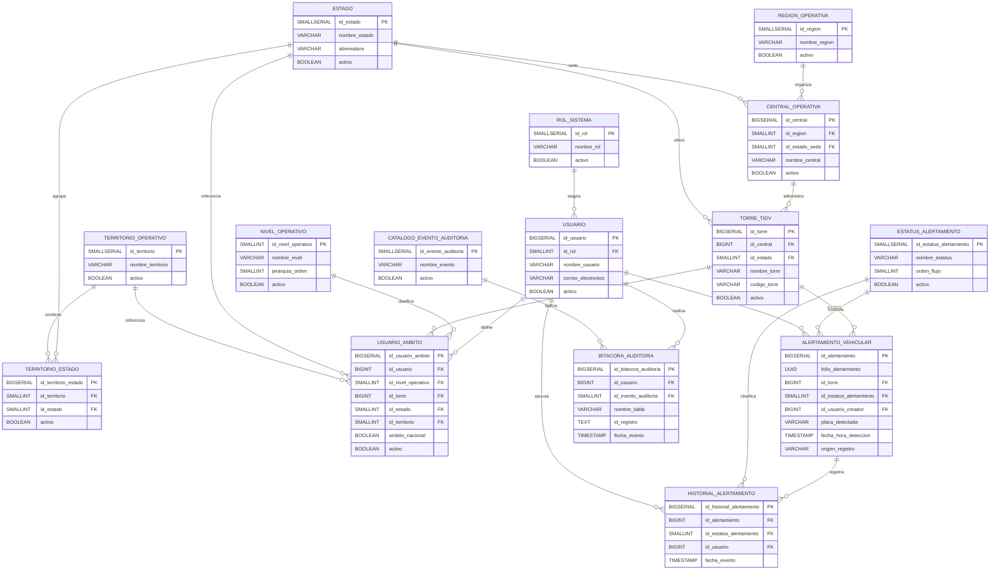

# Diagrama E-R en Mermaid

## Nota de lectura

- La jerarquia operativa esta representada por `region_operativa`, `central_operativa` y `torre_tidv`.
- La visibilidad institucional esta representada por `nivel_operativo` y `usuario_ambito`.
- El rol funcional esta representado por `rol_sistema`.
- `central_operativa.id_estado_sede` representa la sede administrativa de la central.
- `torre_tidv.id_estado` representa el estado operativo real de la torre.
